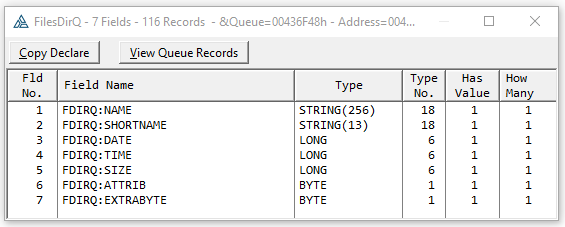
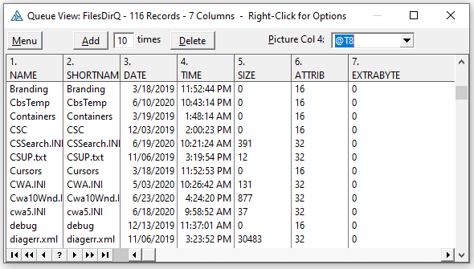

## View Queue without a Window

If you have a Queue but no Window with a LIST you can view it using a call to QueueReflection like the below code and in the example in this folder.

```clarion
WndPrvCls     CBWndPreviewClass

    WndPrvCls.QueueReflection(FilesDirQ,'FilesDirQ')

```

It opens to a window showing the Queue Definition. You can copy that definition to the clipboard.



Click View Queue Records to see the Queue records. The menu button allows copying the entire queue to the clipboard. Add button adds duplicates of the selected row. Delete button deletes the selected row. Right-click on the list for options like to copy the cell contents to the clipboard, change the column picture or hide the column.



* Add records. Sometimes a generated preview is short records to fill the window.
* Delete record
* Change column picture e.g. for Dates and times show as @d @t pictures
* Hide Column
* Shrink or Expand All Columns.
* Copy entire Queue to Clipboard either space delimited or tab delimite for paste into Excel
* Copy row to Clipboard
* Copy cell to Clipboard
* View row or cell as text
