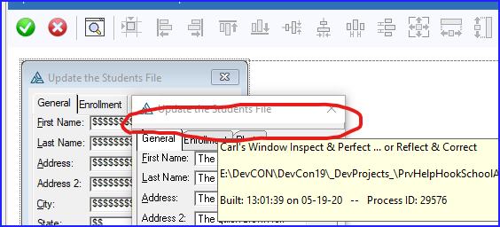
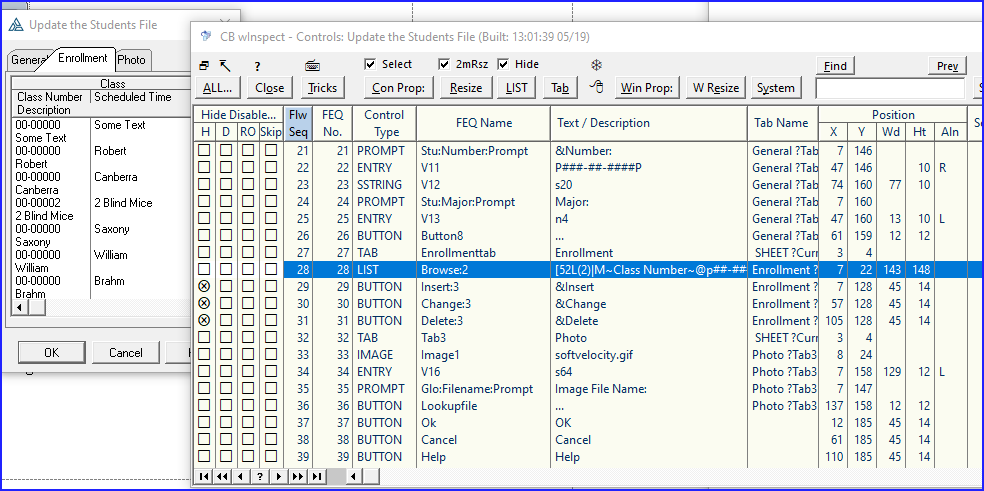
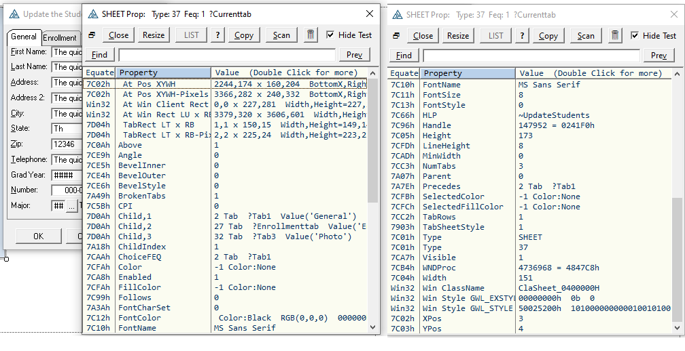
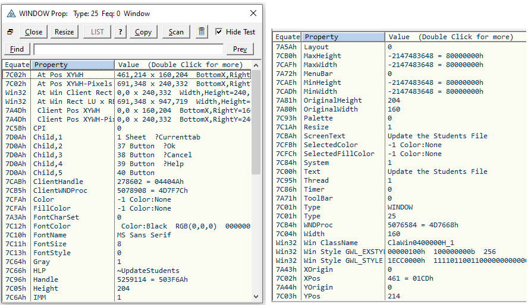
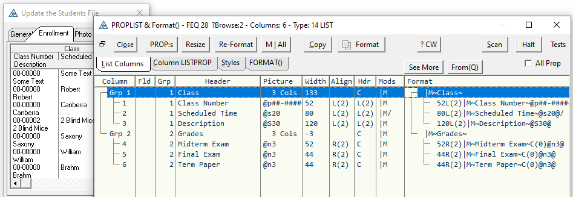
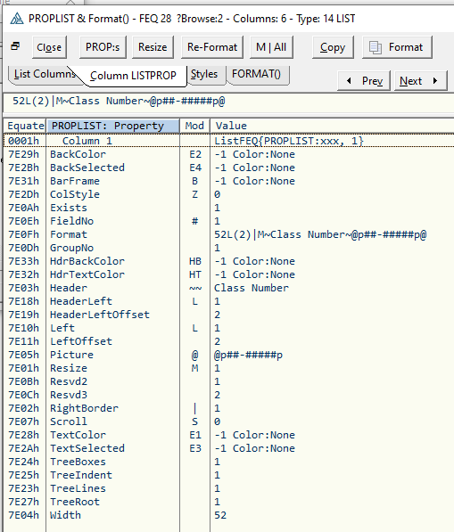

# About WindowPreview Class
 -------------------------
 Window Preview and Reflection Class. 
 
Watch ClarionLive [Webinar Episode 562 Live Window WYSIWYG Design and PROPs Reflection](https://www.clarionlive.com/BrowseEpisodes/ww) also on [YouTube](https://www.youtube.com/watch?v=YdF_G1CWvEA)
 
# Overview #

On a Window preview hover near the top of the window to find the secret flat button pop out and click it. This gives you a form of Reflection on all the properties of the window as well as letting you modify many properties.

Brings up a list of fields on the window with various info. The first four columns allow making Hide-Disable-ReadOnly-Skip fields usable in the preview. 

Click "Con Prop" to see Control Properties specific to the control. 

Click "Win Prop" to see Window Properties.

For LIST controls the Format can be show in a table.

View a LIST Column Properties.

View List From(Queue) definition. This is only available if the class is used in a live program (not preview). It requires adding the global extension template to store a reference to the From(Q) in a user defined property  {'FromQ'}. This require C10. See this in the School example. In capture below note the fields 12-16 not in a list column.

Click the "View From(Q)" button to browse the contents of the entire From(Q). Right click to copy to clipboard. This lets you see the values of non-visible fields (like tree level or style number) to see if they are what you expected or require.

The LIST Re-Format button allows changing most column properties on the live window to see exasctly what they will look like. I use this most to get the width I desire. You can change heading text and alignment to get just the look you want.

