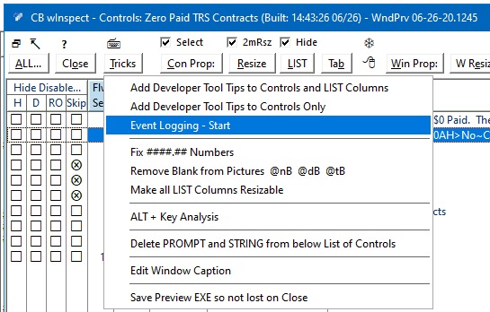

## Event Logging

Event Logging can be started (or stopped) using the Tricks menu. All events of the preview window are logged to a text file and also sent to Debug View. When Stop is selected on Tricks, or the window is closed, the log opens in Notepad.

You can use Event Logging in hand code by calling .EvtLogStart() and .EvtLogStart(). You can call .EvtLogWrite(string) to add comments to the file, this is ignore if logging is not active so it's safe to leave write calls in code.



This is an experiment of something I thought would be interesting. As I am designing a window I can preview it then turn on logging to see the events. It will also for a live window that opens WndPreview. I used the RTL WslDebug$Print function to not need a file. Normally it writes to C110LOG.TXT but I used WslDebug$SetLogFile to rename the file WndPrv_EventLog_Date_Time.txt.

Note the log shows more than simply Event() and Field(), e.g.:
* LIST shows Keycode() and Choice()
* LIST shows PROPLIST:Mouse Down/Up/Move Row/Field/Zone events as "`KeyCode:MouseLeft DnRow:10  MvRow:10  UpRow:10  DnFld:2  MvFld:2  UpFld:2`" and Mouse key used
* SHEET shows TAB choice FEQ
* OPTION shows RADIO choice FEQ, first you'll see the RADIO get EVENT:Selected
* Focus() is logged if different than Field()
* Event:Accepted shows CONTENTS()
* Event:AlertKey and PreAlertKey show KeyCode()
* Event:Rejected shows RejectCode() and Prop:ScreenText
* Event:Drop shows DropID()
* Event:Selecting is NOT logged because it usually duplicates Event:Selected. I forgot it occurred so maybe I should log it? Cycle prevents EVENT:Selected.  


#### Sample log of Browse with LIST:

```
WndPreview Class Event Log JUN 26,2020 @  3:53:18PM
Window: Employee Types     EXE: E:\Dev10Carl\WndPreview\PPT_WndPrevPrj.exe
================================================================================
15:53:19.65 ** WndPreview Reflection Exit **
15:53:20.89 EVENT:NewSelection   ?BROWSEEMPTYPES (1) LIST Choice:1 KeyCode:MouseLeft DnRow:1  MvRow:1  UpRow:1  DnFld:2  MvFld:2  UpFld:2
15:53:20.90 EVENT:Accepted       ?BROWSEEMPTYPES (1) LIST Choice:1 KeyCode:MouseLeft DnRow:1  MvRow:1  UpRow:1  DnFld:2  MvFld:2  UpFld:2
15:53:21.37 EVENT:NewSelection   ?BROWSEEMPTYPES (1) LIST Choice:4 KeyCode:MouseLeft DnRow:4  MvRow:4  UpRow:4  DnFld:2  MvFld:2  UpFld:2
15:53:21.37 EVENT:Accepted       ?BROWSEEMPTYPES (1) LIST Choice:4 KeyCode:MouseLeft DnRow:4  MvRow:4  UpRow:4  DnFld:2  MvFld:2  UpFld:2
15:53:22.25 EVENT:NewSelection   ?BROWSEEMPTYPES (1) LIST Choice:5 KeyCode:DownKey
15:53:22.25 EVENT:Accepted       ?BROWSEEMPTYPES (1) LIST Choice:5 KeyCode:DownKey
15:53:22.45 EVENT:NewSelection   ?BROWSEEMPTYPES (1) LIST Choice:6 KeyCode:DownKey
15:53:22.45 EVENT:Accepted       ?BROWSEEMPTYPES (1) LIST Choice:6 KeyCode:DownKey
15:53:22.63 EVENT:NewSelection   ?BROWSEEMPTYPES (1) LIST Choice:7 KeyCode:DownKey
15:53:22.63 EVENT:Accepted       ?BROWSEEMPTYPES (1) LIST Choice:7 KeyCode:DownKey
15:53:22.82 EVENT:NewSelection   ?BROWSEEMPTYPES (1) LIST Choice:8 KeyCode:DownKey
15:53:22.82 EVENT:Accepted       ?BROWSEEMPTYPES (1) LIST Choice:8 KeyCode:DownKey
15:53:25.60 EVENT:NewSelection   ?BROWSEEMPTYPES (1) LIST Choice:10 KeyCode:MouseLeft DnRow:10  MvRow:10  UpRow:10  DnFld:2  MvFld:2  UpFld:2
15:53:25.61 EVENT:Accepted       ?BROWSEEMPTYPES (1) LIST Choice:10 KeyCode:MouseLeft DnRow:10  MvRow:10  UpRow:10  DnFld:2  MvFld:2  UpFld:2
15:53:25.81 EVENT:NewSelection   ?BROWSEEMPTYPES (1) LIST Choice:10 KeyCode:MouseLeft2 DnRow:10  MvRow:10  UpRow:10  DnFld:2  MvFld:2  UpFld:2
15:53:25.82 EVENT:Accepted       ?BROWSEEMPTYPES (1) LIST Choice:10 KeyCode:MouseLeft2 DnRow:10  MvRow:10  UpRow:10  DnFld:2  MvFld:2  UpFld:2
15:53:26.78 EVENT:NewSelection   ?BROWSEEMPTYPES (1) LIST Choice:5 KeyCode:MouseRight DnRow:5  MvRow:5  UpRow:5  DnFld:2  MvFld:2  UpFld:2
15:53:26.78 EVENT:Accepted       ?BROWSEEMPTYPES (1) LIST Choice:5 KeyCode:MouseRight DnRow:5  MvRow:5  UpRow:5  DnFld:2  MvFld:2  UpFld:2
15:53:28.70 EVENT:TabChanging    ?SHEET1 (13) SHEET Focus()=?BROWSEEMPTYPES (1) Choice:?TAB1 (14)
15:53:28.70 EVENT:NewSelection   ?SHEET1 (13) SHEET Focus()=?BROWSEEMPTYPES (1) Choice:?TAB2 (15)
15:53:29.28 EVENT:TabChanging    ?SHEET1 (13) SHEET Focus()=?BROWSEEMPTYPES (1) Choice:?TAB2 (15)
15:53:29.29 EVENT:NewSelection   ?SHEET1 (13) SHEET Focus()=?BROWSEEMPTYPES (1) Choice:?TAB3 (16)
15:53:31.18 EVENT:Selected       ?SELECT (2) BUTTON Focus()=?BROWSEEMPTYPES (1)
15:53:31.27 EVENT:Accepted       ?SELECT (2) BUTTON
15:53:31.84 EVENT:Selected       ?VIEW (3) BUTTON Focus()=?SELECT (2)
15:53:31.93 EVENT:Accepted       ?VIEW (3) BUTTON
15:53:32.33 EVENT:Selected       ?INSERT (4) BUTTON Focus()=?VIEW (3)
15:53:32.46 EVENT:Accepted       ?INSERT (4) BUTTON
15:53:34.37 EVENT:Selected       ?SHOWTRSRATESONLY (12) CHECK Focus()=?INSERT (4)
15:53:34.47 EVENT:Accepted       ?SHOWTRSRATESONLY (12) CHECK Contents:1
15:53:34.47 EVENT:Selected       ?INSERT (4) BUTTON Focus()=?SHOWTRSRATESONLY (12)
15:53:35.11 EVENT:Selected       ?SHOWTRSRATESONLY (12) CHECK Focus()=?INSERT (4)
15:53:35.23 EVENT:Accepted       ?SHOWTRSRATESONLY (12) CHECK Contents:0
15:53:35.24 EVENT:Selected       ?INSERT (4) BUTTON Focus()=?SHOWTRSRATESONLY (12)
15:53:38.31 EVENT:CloseWindow     WINDOW
15:53:38.31 EVENT:LoseFocus       WINDOW
```

#### Sample log of FORM:

```
WndPreview Class Event Log JUN 26,2020 @  2:24:07PM
Window: Update Employee Type     EXE: E:\Dev10Carl\WndPreview\PPT_WndPrevPrj.exe
================================================================================
14:24:09.66 ** WndPreview Reflection Exit **
14:24:10.78 EVENT:Selected       ?TYP:TRSJOBCATEGORY:RADIO1 (6) RADIO Focus()=?TYP:CODE (1)
14:24:10.87 EVENT:Accepted       ?TYP:TRSJOBCATEGORY (5) OPTION Focus()=?TYP:TRSJOBCATEGORY:RADIO1 (6) Choice:?TYP:TRSJOBCATEGORY:RADIO1 (6) Contents:T
14:24:11.46 EVENT:Selected       ?TYP:TEACHERSUBSTITUTE (12) CHECK Focus()=?TYP:TRSJOBCATEGORY:RADIO1 (6)
14:24:12.22 EVENT:Selected       ?TYP:CERTIFEDPERSONNEL:RADIO2 (16) RADIO Focus()=?TYP:TEACHERSUBSTITUTE (12)
14:24:13.28 EVENT:Selected       ?TYP:CERTIFEDPERSONNEL:RADIO1 (15) RADIO Focus()=?TYP:CERTIFEDPERSONNEL:RADIO2 (16)
14:24:13.40 EVENT:Accepted       ?TYP:CERTIFIEDPERSONNEL (14) OPTION Focus()=?TYP:CERTIFEDPERSONNEL:RADIO1 (15) Choice:?TYP:CERTIFEDPERSONNEL:RADIO1 (15) Contents:Y
14:24:13.93 EVENT:Selected       ?TYP:CERTIFEDPERSONNEL:RADIO2 (16) RADIO Focus()=?TYP:CERTIFEDPERSONNEL:RADIO1 (15)
14:24:14.06 EVENT:Accepted       ?TYP:CERTIFIEDPERSONNEL (14) OPTION Focus()=?TYP:CERTIFEDPERSONNEL:RADIO2 (16) Choice:?TYP:CERTIFEDPERSONNEL:RADIO2 (16) Contents:N
14:24:15.38 EVENT:Selected       ?TYP:STUDENTCATEGORY:RADIO1 (18) RADIO Focus()=?TYP:CERTIFEDPERSONNEL:RADIO2 (16)
14:24:15.85 EVENT:Selected       ?TYP:EEOCREPORTABLE:RADIO2 (22) RADIO Focus()=?TYP:STUDENTCATEGORY:RADIO1 (18)
14:24:17.15 EVENT:Selected       ?TYP:NORMALHRSPERDAY (24) ENTRY Focus()=?TYP:EEOCREPORTABLE:RADIO2 (22)
14:24:18.85 EVENT:Rejected       ?TYP:NORMALHRSPERDAY (24) ENTRY Reject:4 ScrTxt:500
14:24:18.86 EVENT:Selected       ?TYP:PAYGROUP (26) ENTRY Focus()=?TYP:NORMALHRSPERDAY (24)
14:24:19.76 EVENT:Selected       ?TYP:NORMALHRSPERDAY (24) ENTRY Focus()=?TYP:PAYGROUP (26)
14:24:23.08 EVENT:Accepted       ?TYP:NORMALHRSPERDAY (24) ENTRY Contents:8.5
14:24:23.08 EVENT:Selected       ?TYP:PAYGROUP (26) ENTRY Focus()=?TYP:NORMALHRSPERDAY (24)
14:24:25.28 EVENT:Accepted       ?TYP:PAYGROUP (26) ENTRY Contents:4
14:24:25.29 EVENT:Selected       ?CPCSLOOKUPDISPLAY (27) BUTTON Focus()=?TYP:PAYGROUP (26)
14:24:27.85 EVENT:Selected       ?TYP:BENEFITGROUP:RADIO3 (32) RADIO Focus()=?CPCSLOOKUPDISPLAY (27)
14:24:27.94 EVENT:Accepted       ?TYP:BENEFITGROUP (29) OPTION Focus()=?TYP:BENEFITGROUP:RADIO3 (32) Choice:?TYP:BENEFITGROUP:RADIO3 (32) Contents:3
14:24:28.20 EVENT:Selected       ?TYP:BENEFITGROUP:RADIO5 (34) RADIO Focus()=?TYP:BENEFITGROUP:RADIO3 (32)
14:24:28.33 EVENT:Accepted       ?TYP:BENEFITGROUP (29) OPTION Focus()=?TYP:BENEFITGROUP:RADIO5 (34) Choice:?TYP:BENEFITGROUP:RADIO5 (34) Contents:5
14:24:29.94 EVENT:Selected       ?TYP:DESC (4) ENTRY Focus()=?TYP:BENEFITGROUP:RADIO5 (34)
14:24:32.49 EVENT:Accepted       ?TYP:DESC (4) ENTRY Contents:Code #55DDDDD                 
14:24:32.50 EVENT:Selected       ?OK (77) BUTTON Focus()=?TYP:DESC (4)
14:24:32.54 EVENT:Accepted       ?OK (77) BUTTON
14:24:33.59 EVENT:Selected       ?CANCEL (78) BUTTON Focus()=?OK (77)
14:24:33.69 EVENT:CloseWindow     WINDOW
14:24:33.69 EVENT:LoseFocus       WINDOW
```
