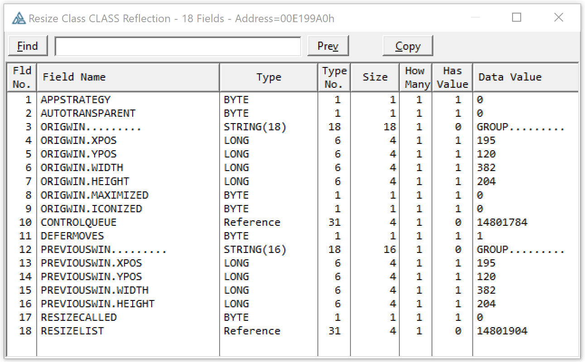
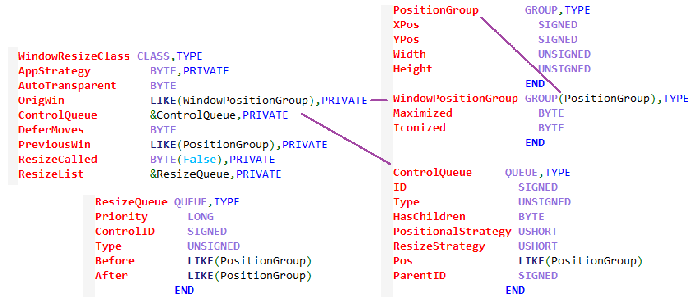
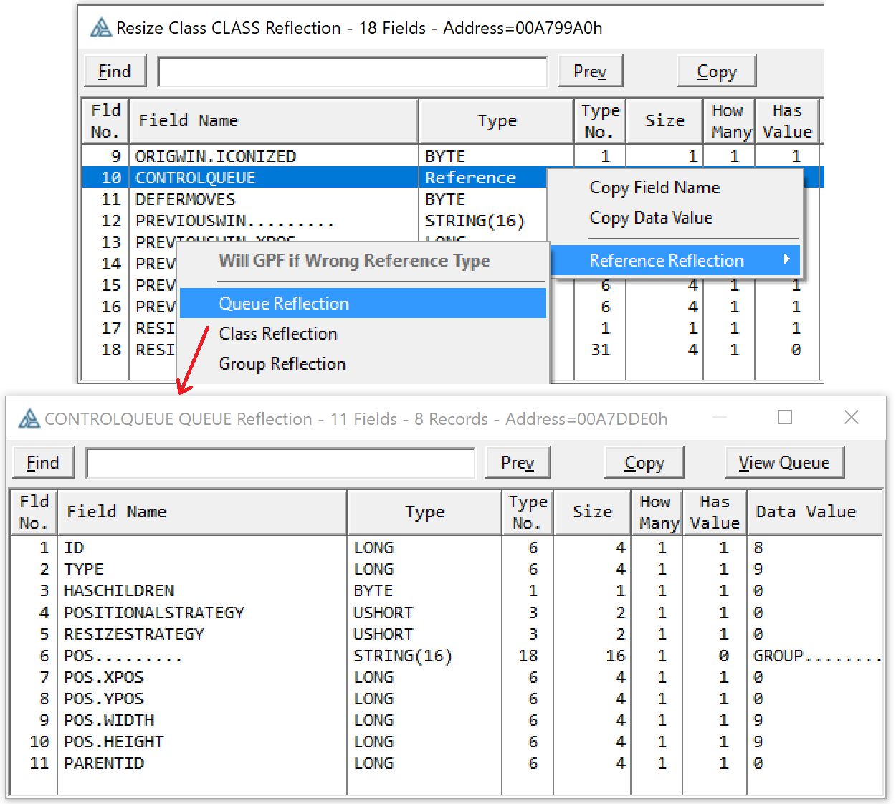
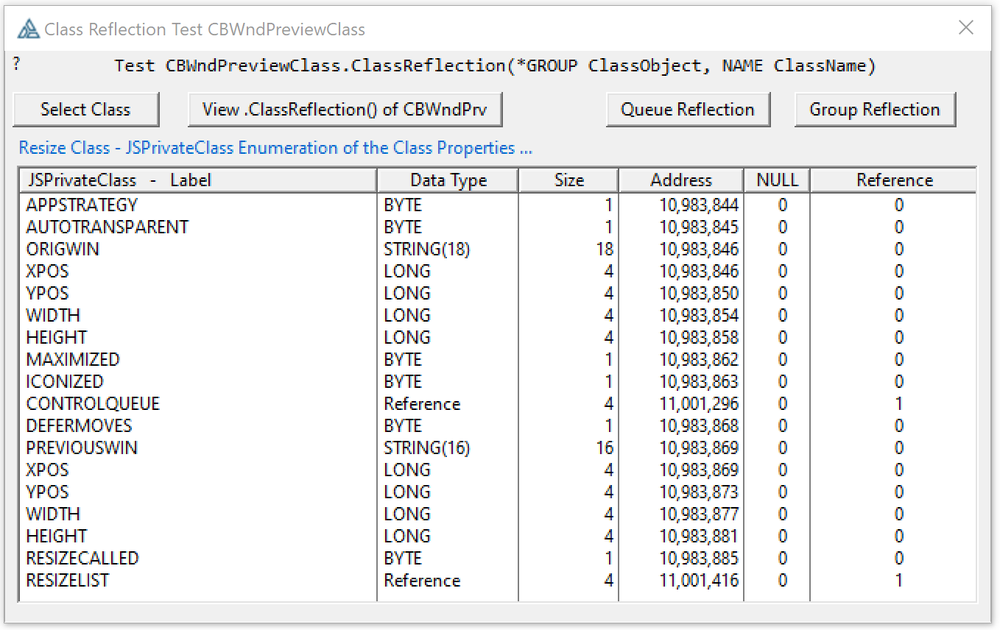
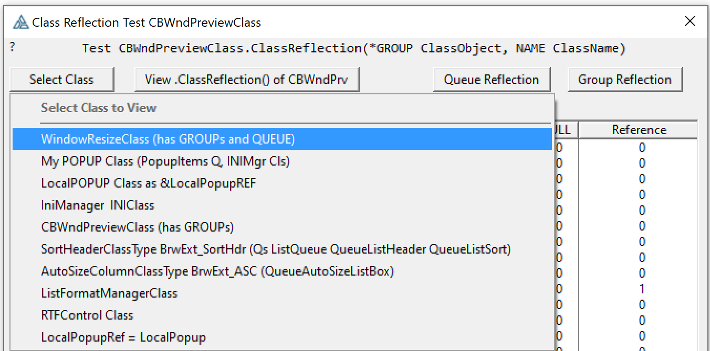

## Class Reflection Viewer

Classes have data, some of it private, often its helpful to see inside the Class to observe how the class code is setting the class data. 
 I was working with Capesoft's MessageBox and wanted to see how code had set many of its properties (data) in both its Global and Enhanced ThisMessageBox classes.
 With one call to .ClassReflection(Class) you can view it all in a Window.
 In this example I'll use the AB ResizeClass which has Groups and Queues.
 
If you have a Class you can view it using a call to`.ClassReflection()` like the below code and in the ClassReflectTest example in this folder.

```clarion
WndPrvCls     CBWndPreviewClass
    WndPrvCls.ClassReflection(ResizeCls,'Resize Class')
```

It opens a window showing the Class Variables and Data Value. You can copy that to the clipboard in tab or space delimited. It can be pasted into Excel to compare data between two tests.






If you know a Class property is a QUEUE or CLASS you can right-click on it and open a reflection window to dig deeper.
 The below screen capture of the Resize Class lists ControlQueue that can be viewed by right clicking on it. 



The test program in this folder is based on JSlarve's Private Data. 
You can select 10 different classes and view Jeff's Enumeration, then click the Class Reflection button to see my window.



